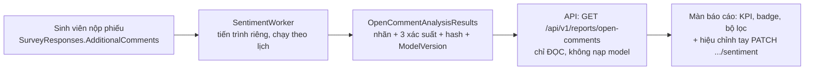

# Phân loại cảm xúc ý kiến mở — cơ chế, thuật toán, triển khai

Tài liệu ngắn để đọc trước khi động vào tính năng này. Chi tiết đầy đủ nằm ở
`docs/plans/phan-loai-y-kien-mo-theo-cam-xuc.md` (kế hoạch) và
`ml/open_comment_sentiment/README.md` (pipeline huấn luyện).

Thuật toán gán nhãn và quá trình huấn luyện mô hình (dữ liệu, tokenizer, hàm mất mát, siêu tham số,
cân chỉnh ngưỡng, xuất ONNX, mã giả quy tắc 5 nhãn) nằm ở
`docs/thuat-toan-va-huan-luyen-mo-hinh-cam-xuc.md`.

## 1. Tóm tắt trong bốn câu

Một model **PhoBERT-base-v2** đã fine-tune trên **NEU-ESC** (3 lớp: `Negative`, `Neutral`, `Positive`)
được xuất sang **ONNX** (515 MiB) và chạy bằng ONNX Runtime trên CPU, **ngay trong hạ tầng của nhà trường**,
không gọi dịch vụ suy luận bên ngoài. Nó chỉ trả về ba xác suất; hai nhãn `Mixed` và `Uncertain` do
**quy tắc ở tầng application** suy ra từ ba xác suất đó, nên có **5 nhãn hiển thị**. Suy luận nằm trong
một **tiến trình riêng** (`SentimentWorker`), không bao giờ nằm trong tiến trình API. Worker chạy
**một lượt rồi thoát** theo lịch, ghi kết quả vào bảng `OpenCommentAnalysisResults`.

## 2. Ai làm gì



| Thành phần | Việc | Không được làm |
| --- | --- | --- |
| `src/Backend/SentimentWorker/` | Nạp model, suy luận, ghi kết quả | Không sửa nội dung ý kiến, không ghi nội dung vào log |
| API (`src/Backend/API`) | Đọc kết quả, xếp hàng chạy lại, ghi nhãn hiệu chỉnh tay | Không có tham chiếu ONNX — không có đường nào nạp model |
| `src/Backend/Application/Reports/OpenCommentSentimentRules.cs` | Quy tắc suy ra `Mixed`/`Uncertain` | Không phụ thuộc model — test được bằng số liệu dựng sẵn |

Kiến trúc này là kết quả của một quyết định có đo lường: model giữ **~1,0 GB RAM** thường trú và **một nhân CPU**,
trên máy chủ 2 vCPU / 4 GB RAM thì để nó trong tiến trình API là lấy mất một phần tư bộ nhớ và một nửa CPU.
Đo được: API khi không có model là **~142 MB RSS**; một lượt chạy với hàng đợi rỗng tốn **2,2 giây** và
**không mở tệp ONNX**.

## 3. Thuật toán, từng bước

### 3.1. Nạp model (một lần cho cả tiến trình)

- `scripts/prepare_backend_model.py` dựng bundle `models/open-comment-sentiment/` gồm tệp ONNX, tokenizer
  (`vocab.txt`, `bpe.codes`, `added_tokens.json`) và `model-card.json` chứa hash SHA-256 từng tệp.
- ONNX Runtime: `ORT_SEQUENTIAL`, `IntraOpNumThreads = 1`, `InterOpNumThreads = 1` (cấu hình, **không** để
  ONNX tự lấy hết nhân). Đầu vào `input_ids` + `attention_mask`, đầu ra một tensor logits 3 lớp.
- Nạp **lười**: chỉ khi thật sự có ý kiến cần phân tích. Thất bại thì thử lại sau 30 giây, không thử lại
  cho từng bản ghi.

### 3.2. Tiền xử lý

Chỉ **cắt khoảng trắng hai đầu**, giữ nguyên phần thân kể cả xuống dòng và khoảng trắng lặp — tokenizer
của PhoBERT bỏ qua khoảng trắng khi tách từ, nên giữ nguyên thân là cách duy nhất để chuỗi token khớp
lúc huấn luyện. Một bản chuẩn hoá mạnh hơn (NFC + gộp khoảng trắng) chỉ dùng để **băm** nội dung, phục vụ
phát hiện ý kiến bị sửa, **không** dùng làm đầu vào model.

### 3.3. Suy luận

Tokenize bằng BPE (tự viết trong `PhobertTokenizer`, không phụ thuộc thư viện ngoài), cắt ở **256 token**,
padding theo lô **16 ý kiến**. Logits → softmax:

$$p_i = \frac{e^{z_i - \max z}}{\sum_j e^{z_j - \max z}}$$

với thứ tự xác suất **`[Negative, Neutral, Positive]`** (đúng thứ tự logits, không phải thứ tự hiển thị).
Ý kiến rỗng **không** tốn lượt suy luận nào: mặc định là `Uncertain` với độ tin cậy 0.

### 3.4. Lượt suy luận theo mệnh đề (chỉ khi cần)

Tách mệnh đề theo từ tương phản và dấu câu (`nhưng`, `tuy nhiên`, `mặc dù vậy`, `song`, `dẫu vậy`,
`thế nhưng`, `;`, `!`, `?`, xuống dòng, và dấu chấm hết câu — tức dấu chấm có khoảng trắng theo sau và ký tự
ngay trước nó không phải chữ số, để không cắt vào số thập phân). Chỉ chạy lượt suy luận thứ hai khi ý kiến có
**≥ 2 mệnh đề** hoặc có **dấu hiệu tương phản**; mệnh đề phải có ít nhất hai từ mới được giữ, còn không thì
dùng nguyên văn bản. Trường hợp một mệnh đề đơn giản thì dùng luôn xác suất toàn câu — giữ đúng như bản
Python để hai bên ra cùng nhãn.

### 3.5. Quy tắc 5 nhãn

Xét đúng thứ tự này (hàm `OpenCommentSentimentRules.Resolve`):

1. **`Mixed`** — khi có ít nhất một mệnh đề đạt ngưỡng ở vế tích cực **và** một mệnh đề khác đạt ngưỡng ở
   vế tiêu cực. Điều kiện xét theo **khối xác suất** của mệnh đề: `p(Positive) ≥ 0,20` thì tính là vế
   tích cực, ngược lại `p(Negative) ≥ 0,20` thì tính là vế tiêu cực (nhánh `else if` nghĩa là một mệnh đề
   không thể vừa tích cực vừa tiêu cực). Độ tin cậy của `Mixed` là **mức thấp hơn** trong hai vế — kết luận
   chỉ chắc bằng vế yếu nhất.
2. **`Uncertain`** — không `Mixed`, và xác suất lớn nhất của cả ý kiến **< 0,45**.
3. **Còn lại** — nhãn có xác suất cao nhất (`Negative` / `Neutral` / `Positive`).
4. **Ý kiến rỗng** — luôn `Uncertain`, độ tin cậy 0.

> Chỗ này từng có một lỗi thật: bản cũ đòi `argmax` của mệnh đề phải đúng cực, nên một vế phàn nàn mà
> model gọi là `Neutral` dù `p(Negative) = 0,45` bị bỏ qua hoàn toàn. Đổi sang khối xác suất, trên tập
> test đóng băng 200 câu: recall `Mixed` **0,2241 → 0,5862**, accuracy **0,6600 → 0,7650**, precision của
> tập bị gắn cờ giữ nguyên **1,0000**. Đây là lỗi quy tắc, không phải lỗi model.

### 3.6. Ghi kết quả

Worker nhặt những phiếu có `AdditionalComments` khác rỗng **và chưa có kết quả đúng cả `ModelVersion`
lẫn `RuleVersion`**, theo lô `MaxCommentsPerScan = 500`. Mỗi dòng lưu: nhãn, độ tin cậy, ba xác suất,
`ModelVersion`, `RuleVersion`, `ContentHash`, `AnalyzedAt`. **Không sao chép nội dung ý kiến sang bảng
kết quả.**

**Vì sao phải có `RuleVersion`.** Nhãn sinh ra từ hai thứ độc lập: model ba lớp và quy tắc suy ra
`Mixed`/`Uncertain` (kèm hai ngưỡng của nó). Chỉ ghi phiên bản model là bỏ lọt trường hợp thứ hai: bản
sửa quy tắc ngày 20/09/2026 giữ nguyên `ModelVersion`, nên nếu không có cột này thì 490 dòng cũ vẫn
được coi là "đã đúng phiên bản" và nhãn cũ nằm im mãi. Giá trị ghi xuống là **phiên bản quy tắc hiệu
lực** = tên quy tắc + ngưỡng, ví dụ `rules-v2:c0.45:m0.2`; đổi quy tắc **hoặc** đổi ngưỡng trong
`appsettings.json` đều làm kết quả cũ tự thành "còn nợ".

`ManualSentiment` (nhãn hiệu chỉnh tay) nằm **trên cùng dòng** với kết quả model và là nhãn có hiệu lực khi
hiển thị (`EffectiveSentiment = ManualSentiment ?? Sentiment`). Worker không bao giờ ghi vào cột đó. Bảng này
bị loại khỏi `AuditInterceptor` tự động (worker ghi hàng nghìn dòng mỗi lượt quét); chỉ thao tác thủ công mới
ghi một dòng audit, không kèm nội dung ý kiến.

## 4. Cấu hình hiện tại

| Tham số | Giá trị | Ghi chú |
| --- | --- | --- |
| `ModelVersion` | `phobert-neu-esc-v1` | **Phải trùng** giữa API và worker, nếu không API coi mọi ý kiến là còn nợ |
| `RuleVersion` | `rules-v2` | Tên phiên bản **quy tắc**, khác model. Giá trị ghi xuống DB là phiên bản hiệu lực = tên + ngưỡng, hiện là `rules-v2:c0.45:m0.2` |
| `MaxSequenceLength` | 256 | Cắt token khi suy luận |
| `BatchSize` | 16 | Số ý kiến mỗi lượt suy luận |
| `ConfidenceThreshold` | 0,45 | Dưới ngưỡng này (và không `Mixed`) → `Uncertain` |
| `MixedThreshold` | 0,20 | Ngưỡng khối xác suất để một mệnh đề tính là rõ cực |
| `InferenceThreads` | 1 | Có chủ đích: xem mục 2 |
| `MaxCommentsPerScan` | 500 | Trần số ý kiến mỗi vòng quét |
| `ScanIntervalSeconds` | 120 | Chỉ dùng ở chế độ `--watch` |

`models/open-comment-sentiment/model-card.json` là **chỗ đọc cặp phiên bản đang chạy**:

| Khóa trong model card | Giá trị hiện tại |
| --- | --- |
| `model_version` | `phobert-neu-esc-v1` |
| `rule_version` | `rules-v2` |
| `effective_rule_version` | `rules-v2:c0.45:m0.2` |
| `thresholds` | `confidence_threshold: 0.45`, `mixed_clause_min_confidence: 0.2` |
| `max_sequence_length` | 256 |

Model card **không tự nghĩ ra** các giá trị này: `prepare_backend_model.py` đọc chúng từ
`src/Backend/SentimentWorker/appsettings.json`, đối chiếu với `appsettings.json` của API, và **từ chối
đóng gói** nếu hai bên lệch nhau. Trước đây model card lấy ngưỡng từ artifact cân chỉnh cũ nên ghi
`0,35` trong khi sản phẩm chạy `0,20`; lỗi đó đã được sửa ngày 20/09/2026 và nay có test canh:
`tests/UnitTests/Infrastructure/OpenCommentConfigConsistencyTests.cs`.

## 5. Triển khai trên production

### 5.1. Tệp model không đi theo Git

Bundle model bị `.gitignore` (riêng tệp ONNX đã 515 MiB). Máy chủ phải **chép tay cả thư mục**
`models/open-comment-sentiment/`. Thiếu tệp ONNX thì worker thoát với mã `2` và không phân tích gì cả.

### 5.2. Tiến trình và trần tài nguyên

Worker là service trong **profile `sentiment`**, cố ý **không** thuộc nhóm khởi động mặc định và **không**
khai `restart`.

| Service | `cpus` | `mem_limit` | Căn cứ |
| --- | --- | --- | --- |
| `db` | 1,0 | 640 MB | `shared_buffers=64MB`, `max_connections=30` |
| `api` | 1,0 | 768 MB | đo được ~142 MB RSS khi rảnh |
| `frontend` | 0,5 | 128 MB | nginx phục vụ tệp tĩnh |
| `sentiment-worker` | 1,0 | 1536 MB | model ~1,0 GB RSS khi đã nạp |

Tổng trần **3,0 GB**, chừa ~1 GB cho hệ điều hành. Worker bị chặn ở 1,0 nhân để API luôn còn nhân phục vụ.
Đổi bằng biến môi trường trong `.env` (xem `.env.example`).

### 5.3. Chạy theo lịch, không chạy thường trực

```bash
# Thủ công, một lượt
docker compose --profile sentiment run --rm sentiment-worker

# Theo lịch: systemd timer, mặc định 02:00 hằng ngày
sudo cp deploy/systemd/khaosatvmu-sentiment.* /etc/systemd/system/
sudo systemctl daemon-reload
sudo systemctl enable --now khaosatvmu-sentiment.timer
```

Worker chạy một lượt rồi thoát nên **trả lại 1 GB RAM và nhân CPU** cho hệ thống ngay khi xong. Đừng chạy
`--watch` trên máy chủ thật: model sẽ nằm thường trực và chiếm một nhân suốt thời gian chạy. Worker tự ghi
một dòng cảnh báo khi thấy máy có ≤ 2 nhân CPU.

**Khi nào số liệu mới được phân tích?** Không tự động — **"công tắc" của tính năng chính là việc chạy
tiến trình worker**, và không có gì chạy nó thay bạn:

| Hoàn cảnh | Cách số liệu mới được phân tích |
| --- | --- |
| Máy phát triển | Chạy tay: `dotnet run --project src/Backend/SentimentWorker` (hoặc `docker compose --profile sentiment run --rm sentiment-worker`). Một lượt với vài ý kiến mất khoảng chục giây, phần lớn là thời gian nạp model 515 MB chứ không phải suy luận |
| Máy phát triển — muốn số liệu tự lên | `scripts\start-sentiment-daemon.cmd` và **để cửa sổ mở**; dừng bằng `Stop-Process -Name SentimentWorker`. Đang có tiến trình nền thì `dotnet run` (không có `--no-build`) sẽ **báo lỗi khoá tệp DLL** — dừng nền trước |
| Máy chủ — mặc định | systemd timer trong `deploy/systemd/`, **02:00 hằng ngày**. Không chạy gì trong ngày |
| Máy chủ — khi cần "bấm là có ngay" | `khaosatvmu-sentiment-daemon.service`: worker chạy nền, quét mỗi **15 giây**, và **trả model lại cho hệ điều hành sau 2 phút rảnh**. Đây là câu trả lời cho "đang họp mà muốn số liệu ngay" — **đừng bật cùng lúc với timer**, hai worker cùng chạy là hai bản model trong RAM |

Đo trên máy phát triển cho chế độ chạy nền: **85–129 MB khi rảnh** (model chưa nạp hoặc đã nhả), **~1,0 GB đang suy luận** (1007 MB), và RAM **trở về mức cũ** sau khi rảnh — nên "chạy nền" không có nghĩa là giữ model thường trực. Đổi lại, lần có việc sau một quãng rảnh phải nạp lại tệp 515 MB, nên đừng đặt `IdleUnloadSeconds` quá nhỏ.

Màn báo cáo **không** có nút nào chạy model. Nút "xếp hàng phân tích lại" mà tài liệu cũ nhắc tới thì
**chưa tồn tại** ở giao diện — hai endpoint `model-status` và `reanalyze` hiện chỉ gọi được bằng tay qua
API. Vì vậy một ý kiến mới nộp sẽ nằm ở trạng thái "Chưa phân tích" cho tới lượt chạy worker kế tiếp, và
con số trên màn báo cáo chỉ đổi sau đó. Đó cũng là lý do KPI ghi "còn N ý kiến chờ xử lý và chưa nằm trong
mẫu số" thay vì gộp chúng vào một nhãn nào.

**Chạy ngoài giờ cao điểm là yêu cầu, không phải khuyến nghị — đã đo ngày 20/09/2026.** Ghim API và worker
vào cùng hai nhân (mô phỏng máy chủ 2 vCPU) rồi cho 16 kết nối đọc `GET /api/v1/reports/open-comments`:

| | Worker rảnh | Có worker |
|---|---:|---:|
| Thông lượng | 90,4 req/s | 75,2 req/s (**−16,8%**) |
| p50 | 118 ms | 153 ms (**+30%**) |
| p95 | 451–458 ms | 502–527 ms (**+13,2%** trung bình) |

Với một kết nối duy nhất — phép đo sạch, không có xếp hàng phía client — p95 còn tăng **+53%** và thông
lượng giảm **29%**. Nghĩa là ngay cả một người mở màn báo cáo trong lúc worker đang chạy cũng chờ lâu hơn
khoảng một nửa. Tiêu chí `0.5` ("p95 không tăng quá 10%") vì thế **chưa đạt**; cách duy nhất để đạt là
chạy worker ngoài giờ, hoặc nâng máy chủ. Số liệu thô: `artifacts/load-test/*.json`; cách đo và các giới
hạn của phép đo ở mục 5.9 của kế hoạch.

Lệnh đo lại bất cứ lúc nào (API phải chạy ở môi trường Development để có đường đăng nhập dev):

```bash
python scripts/load_test_reports.py --url http://localhost:5115 \
    --email <email quan tri> --concurrency 16 --duration 40 --json-out artifacts/load-test/lan-do.json
```

| Mã thoát | Nghĩa |
| --- | --- |
| `0` | Xong việc |
| `2` | Không nạp được model (thiếu tệp, sai định dạng) |
| `3` | Có lô phân tích thất bại |
| `137` | Bị giết vì vượt trần bộ nhớ |

Đo trên dữ liệu dev: quét đủ **490 ý kiến mất 87,5 giây** (một nhân, CPU time ≈ wall time).

### 5.4. Đường API liên quan

| Endpoint | Quyền | Việc |
| --- | --- | --- |
| `GET /api/v1/reports/open-comments` | `REPORTS_ACCESS` | Đọc kết quả đã có, kèm bộ lọc |
| `GET /api/v1/reports/open-comments/model-status` | `OPEN_COMMENT_MODEL_ADMIN` | Số còn nợ, số đã phân tích, `LatestAnalyzedModelVersion` |
| `POST /api/v1/reports/open-comments/reanalyze` | `OPEN_COMMENT_MODEL_ADMIN` + CSRF | **Chỉ xếp hàng**, không chạy model |
| `PATCH /api/v1/reports/open-comments/{responseId}/sentiment` | `OPEN_COMMENT_SENTIMENT_REVIEW` + CSRF | Hiệu chỉnh nhãn tay |

API **không biết** model sống hay chết — không còn health check cho model. Sức khoẻ của nó nằm ở mã thoát
và nhật ký của worker.

## 6. Chất lượng thật và giới hạn đã biết

**Trên tập test NEU-ESC** (6.438 câu): accuracy **0,8074**, macro F1 **0,7385**, recall `Negative` **0,7294**.
Cả hai chỉ tiêu chấp nhận (macro F1 ≥ 0,80 và recall `Negative` ≥ 0,80) đều **chưa đạt**.

**Trên dữ liệu VMU** (pilot 100 câu chấm mù, cân lại về phân bố thật của 490 ý kiến): accuracy **0,6049**,
macro F1 **0,5740**, recall `Negative` **0,5613**. Precision `Negative` **1,0000** và precision của tập bị gắn cờ
(`Negative|Mixed`) **1,0000** (50/50, Wilson lower 0,9286). Nói cách khác: **cái bị gắn cờ thì gần như chắc
đúng, nhưng bỏ sót nhiều** — recall `Mixed` chỉ **0,1675**.

Vì vậy tính năng này phải được đối xử như **gợi ý có người xác nhận**, không phải phán quyết tự động.

**Hướng đang thử (chưa phát hành):** fine-tune tiếp checkpoint hiện có trên 200 câu `calibration` đã
được người chấm. Trên tập `test` đóng băng, accuracy `0,7650` → `0,9000`, macro F1 `0,6024` → `0,7111`,
recall `Mixed` `0,5862` → `0,9310`, và precision của nhóm bị gắn cờ `0,8293` → `0,8953` trong khi nhóm
đó gấp đôi (`41` → `86` câu). **Nhưng recall `Negative` chỉ nhích `0,5385` → `0,5897`, nên vẫn chưa đạt
ngưỡng**, và tập train lẫn tập test cùng một đợt khảo sát nên phần lớn mức tăng có thể chỉ là thích nghi
miền. Không có gì được phát hành: `ModelVersion` không đổi, chưa xuất ONNX. Chi tiết ở mục 5.10 của kế hoạch.

Các giới hạn cần biết trước khi tin vào con số:

- **Phiên bản quy tắc đã tách khỏi phiên bản model (20/09/2026).** Cột `RuleVersion` lưu tên quy tắc
  kèm dấu vân tay của hai ngưỡng, nên đổi quy tắc hoặc đổi ngưỡng là kết quả cũ tự thành "còn nợ" và
  worker phân tích lại ở lượt quét sau — không cần nhớ bấm chạy lại ép buộc. Việc còn lại là **màn
  quản trị**: hai endpoint `model-status` và `reanalyze` hiện chưa có màn hình nào gọi.
- **Pilot không độc lập** với tập test đóng băng: 87/100 câu pilot đã có trong tập gold 400 câu.
- **Dữ liệu dev là văn bản sinh theo mẫu**, không phải phản hồi thật của sinh viên — pilot đo phong cách
  trình bày, không đo thực tế triển khai.
- **Hai nguồn dữ liệu đều không đạt gate.** Artifact đang dùng chỉ huấn luyện trên NEU-ESC vì đó là nguồn
  có giấy phép rõ; UIT-VSFC tốt hơn trong miền nhưng **không có tệp LICENSE** nên không được đưa vào artifact.
- **Cẩn thận với mọi chỉ số tính thẳng trên mẫu phân tầng.** Precision đọc được (có điều kiện theo dự đoán);
  recall, F1, accuracy thì không, phải cân lại trọng số.
- **Độ dài tối đa lúc huấn luyện đã được đưa về khớp runtime (20/09/2026).** Trước đây
  `train_phobert.py` mặc định `--max-length 160` còn runtime cắt ở `256`, và tóm tắt huấn luyện không
  ghi lại giá trị đã dùng — nên không có cách nào biết một checkpoint cũ được dạy ở mức nào. Nay mặc
  định lấy đúng `DEFAULT_MAX_LENGTH = 256`, tóm tắt huấn luyện ghi cả `max_length` và `seed`, và
  script nhận `--seed` để tái lập được. Checkpoint đang chạy vẫn là checkpoint cũ, nên nếu nó được
  dạy ở `160` thì lệch đó vẫn còn cho tới lần huấn luyện tiếp theo.

## 7. Cần chạm vào đâu khi muốn đổi

| Muốn đổi | Sửa ở |
| --- | --- |
| Ngưỡng `ConfidenceThreshold` / `MixedThreshold` | `OpenCommentSentimentOptions.cs` + `appsettings.json` của API và worker, và `docker-compose.yml` nếu đặt qua biến môi trường. Đổi ngưỡng là kết quả cũ tự thành "còn nợ" (vì ngưỡng nằm trong `EffectiveRuleVersion`) |
| Quy tắc `Mixed` / cách tách mệnh đề | `OpenCommentSentimentRules.cs` **và** `inference_engine.py` của bản Python — hai bên phải khớp nhau, và phải **tăng `RuleVersion`** |
| Model mới | `prepare_backend_model.py` (đổi `MODEL_VERSION`), rồi chép bundle lên máy chủ và chạy lại worker |
| Lịch chạy | `deploy/systemd/khaosatvmu-sentiment.timer` |
| Nhãn hiển thị, thống kê | `Domain/OpenCommentAnalysisModels.cs` (`OpenCommentSentiments`) |

Fixture chẵn lẻ (`tokenizer-parity.json`, `phobert-prediction-parity.json`) tồn tại để bắt lệch giữa bản C#
và bản Python. Sửa một bên mà fixture đỏ thì đó là tín hiệu đúng, không phải phiền toái.
