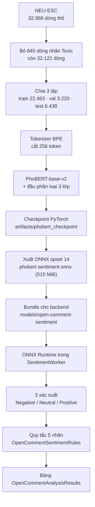

# Thuật toán và huấn luyện mô hình phân loại cảm xúc

> Tài liệu này nói về **mô hình được huấn luyện thế nào** và **thuật toán gán nhãn chạy ra sao** —
> dữ liệu, tokenizer, hàm mất mát, siêu tham số, cân chỉnh ngưỡng, xuất ONNX, và mã giả của quy tắc
> 5 nhãn. Mọi con số đều lấy từ artifact thật trong repo, không có số minh hoạ.
>
> Ba tài liệu đi kèm:
> - `docs/phan-loai-cam-xuc-y-kien-mo.md` — cơ chế chạy trong sản phẩm, cấu hình, triển khai trên máy chủ.
> - `docs/giai-thich-phan-loai-cam-xuc.md` — bản giải thích cho người không kỹ thuật.
> - `docs/plans/phan-loai-y-kien-mo-theo-cam-xuc.md` — kế hoạch, tiêu chí nghiệm thu, nhật ký các lượt đo.


Hạng mục	Giá trị
Mô hình nền	vinai/phobert-base-v2 — PhoBERT-base, kiến trúc RoBERTa-base, ~135 triệu tham số
Loại	Phân loại chuỗi (sequence classification), không phải LLM, không gọi API AI nào bên ngoài
Huấn luyện	Fine-tune trên NEU-ESC (22.463 dòng train), 3 lớp: Negative / Neutral / Positive
Định dạng phát hành	ONNX opset 14, 1 đầu vào input_ids + attention_mask, 1 đầu ra logits
Tệp	phobert-sentiment.onnx — 540.269.848 byte (515 MiB), sha256 187285af…2113
Chạy bằng	ONNX Runtime CPU, trong tiến trình riêng SentimentWorker (không nằm trong API)
ModelVersion (ghi vào DB)	phobert-neu-esc-v1
RuleVersion hiệu lực	rules-v2:c0.45:m0.2
Nhãn	3 nhãn do model sinh + 2 nhãn do quy tắc suy ra: Hỗn hợp, Chưa chắc chắn
---

## 1. Đường đi của dữ liệu



Hai nửa của hệ thống **không phụ thuộc nhau về mặt kỹ thuật**, và đó là chủ đích:

| Nửa | Làm gì | Nằm ở đâu | Có cần model không |
| --- | --- | --- | --- |
| Học máy | Sinh ra 3 xác suất từ câu văn | `ml/open_comment_sentiment/` → ONNX | Có |
| Quy tắc | Biến 3 xác suất thành 5 nhãn, quyết định độ tin cậy | `src/Backend/Application/Reports/OpenCommentSentimentRules.cs` | **Không** |

Nhờ tách như vậy, đổi quy tắc gán nhãn là việc **không cần GPU, không cần huấn luyện lại, và không
cần nạp model 500 MB** để kiểm thử — mục 9 dưới đây là toàn bộ phần đó, và nó chỉ là khoảng 40 dòng
mã.

---

## 2. Dữ liệu huấn luyện

### 2.1. Nguồn

**NEU-ESC** (Hugging Face `hung20gg/NEU-ESC`) — bộ dữ liệu cảm xúc trong môi trường giáo dục, cùng
miền với bài toán khảo sát giảng viên.

| Thuộc tính | Giá trị |
| --- | --- |
| Giấy phép | Nhãn `license: apache-2.0` ở frontmatter. **Lưu ý**: phần thân thẻ dữ liệu chỉ nói "open-source cho nghiên cứu và giáo dục" — hẹp hơn nhãn. Phải xác nhận với chủ dữ liệu trước khi phát hành artifact ra ngoài nhóm |
| Truy cập | Chia sẻ có kiểm soát (`gated: auto`). Cần tài khoản đã chấp nhận điều kiện + `HF_TOKEN` |
| Phiên bản ghim | `daf543ad1992153cd2be9fec3cb59aa0fc714147` |
| Cột dùng | `text`, `sentiment`, `classification` (chủ đề) |
| Ánh xạ nhãn | `0 → Neutral`, `1 → Positive`, `2 → Negative` |

Nhãn gốc thứ tư là **`3 = Toxic`**, và nó **bị loại bỏ hoàn toàn**, không bao giờ gộp vào `Negative`
(585 dòng bị bỏ ở tập train). Lý do không chỉ là kỹ thuật: gộp "xúc phạm" vào "tiêu cực" là dạy mô
hình rằng lời lăng mạ và lời phàn nàn là cùng một loại — sai về nghiệp vụ và sai về đạo đức. Số dòng
bị loại được ghi lại trong `artifacts/neu-esc-audit.json` để kiểm toán.

### 2.2. Quy mô và phân bố

| Tập | Dòng đọc | Dòng giữ | Ghi chú |
| --- | ---: | ---: | --- |
| train | 23.048 | **22.463** | bỏ 585 dòng Toxic |
| val | — | **3.220** | dùng để chọn checkpoint tốt nhất |
| test | — | **6.438** | đo chất lượng |

Phân bố nhãn tập train — đây là lý do phải dùng hàm mất mát có trọng số:

| Nhãn | Số dòng | Tỷ lệ |
| --- | ---: | ---: |
| Neutral | 15.936 | 70,9% |
| Negative | 3.630 | 16,2% |
| Positive | 2.897 | 12,9% |

`Neutral` nhiều gấp **5,5 lần** `Positive`. Huấn luyện không trọng số trên dữ liệu này sẽ cho ra một
mô hình đoán `Neutral` cho gần như mọi câu và vẫn đạt độ chính xác cao — đó là kiểu hỏng tệ nhất vì
nó trông có vẻ thành công.

Kiểm toán dữ liệu (`scripts/audit_neu_esc.py`) xác nhận: **0 dòng trùng lặp trong nội bộ**, **0 dòng
trùng giữa các tập**, độ dài trung bình 103,5 ký tự.

### 2.3. Vì sao không dùng UIT-VSFC

Đã đo và loại bằng số liệu, không bằng cảm tính (`artifacts/local-domain-gap.json`,
`docs/plans/phan-loai-y-kien-mo-theo-cam-xuc.md` Giai đoạn 1):

- UIT-VSFC **không có tệp LICENSE** → không đủ cơ sở để phát hành artifact phái sinh.
- Chuyển miền làm chất lượng sụp: mô hình học UIT-VSFC đạt macro F1 `0,7439` trên chính nó nhưng chỉ
  còn `0,32–0,37` trên NEU-ESC; chiều ngược lại `0,7052 → 0,4430`. Recall `Negative` khi học NEU-ESC
  rồi chạy trên UIT-VSFC chỉ còn `0,2378`/`0,1505`.
- **Bẫy**: huấn luyện trên tập trộn hai nguồn cho macro F1 `0,8138` — cao hơn cả hai nguồn riêng lẻ.
  Con số đó **giả tạo**, do tập test trộn có phân bố lớp nhân tạo. Không bao giờ dùng nó.

### 2.4. Tập vàng cục bộ (để đo trên dữ liệu của trường)

400 ý kiến (toàn bộ tập hợp lệ, không lấy mẫu) được chia cố định, seed 7:

- **200 câu `calibration`** — dùng để dò ngưỡng.
- **200 câu `test`** — **đóng băng**, chỉ đo một lần cho mỗi thay đổi.

Hai người chấm độc lập, **Cohen's Kappa `0,9291`**, 21 câu bất đồng đã được phân xử. Tệp khoá:
`data/processed/local-gold.csv`.

> **Giới hạn phải nói kèm**: 400 câu này là văn bản **sinh theo mẫu câu** trong cơ sở dữ liệu phát
> triển (490 ý kiến nhưng chỉ 12 kiểu đuôi câu, mỗi kiểu lặp 9–15 lần), **chưa phải phản hồi thật của
> sinh viên**. Vì vậy mọi kết quả trên tập này là **tín hiệu**, không phải nghiệm thu.

---

## 3. Tiền xử lý và tokenizer

### 3.1. Tokenizer PhoBERT — không phải BPE kiểu RoBERTa

Đây là chỗ dễ sai nhất và sai thì **không có cảnh báo nào**: `input_ids` lệch so với lúc huấn luyện,
mô hình vẫn chạy, chỉ là dự đoán lệch dần.

PhoBERT dùng `bpe.codes` kiểu **subword-nmt**:

- Ký hiệu cuối từ là `</w>`, không phải tiền tố `Ġ` như RoBERTa/GPT-2.
- Ghép cặp theo **đúng thứ tự dòng** trong tệp `bpe.codes`.
- Mảnh chưa kết thúc từ được đổi thành hậu tố `@@`.
- `vocab.txt` mỗi dòng có dạng `<token> <tần số>`; id của token là **vị trí dòng + 4**, vì bốn token
  đặc biệt `<s>` `0`, `<pad>` `1`, `</s>` `2`, `<unk>` `3`.

Python dùng `AutoTokenizer.from_pretrained(..., use_fast=False)` — **bắt buộc** là bản chậm gốc, bản
`fast` (được viết lại bằng Rust) không tương đương trên bộ vocab này. Phía .NET, tokenizer được
**port tay** (`src/Backend/SentimentWorker/Sentiment/PhobertTokenizer.cs`) và đối chiếu bằng fixture
(mục 10).

### 3.2. Độ dài chuỗi

| Lúc | Cách cắt/đệm | Độ dài |
| --- | --- | --- |
| Huấn luyện | `padding="max_length"` — đệm cứng | **256** (`DEFAULT_MAX_LENGTH`) |
| Suy luận Python | `padding=True` — đệm theo câu dài nhất trong lô | 256 |
| Suy luận .NET | tự đệm theo câu dài nhất trong lô | 256 (`MaxSequenceLength`) |

> **Vết xe đã gặp**: script huấn luyện từng mặc định `--max-length 160` trong khi lúc chạy cắt ở
> 256 — mô hình chưa từng thấy câu dài hơn 160 token nhưng vẫn được đưa tới 256. Tệ hơn nữa, tóm tắt
> huấn luyện cũ **không ghi lại** độ dài đã dùng, nên không có cách nào biết lượt huấn luyện đang chạy
> trong sản phẩm đã chạy ở 160 hay 256. Hai thứ đã được sửa cho các lượt sau: mặc định lấy đúng
> `DEFAULT_MAX_LENGTH`, và `max_length` + `seed` được ghi vào
> `artifacts/phobert-training-summary.json`. **Checkpoint đang triển khai vẫn là lượt cũ, chưa có hai
> trường đó** (xem mục 11).

### 3.3. Chuẩn hoá nội dung

Hai bản chuẩn hoá **khác nhau**, và không được lẫn:

| Dùng cho | Cách làm | Vì sao |
| --- | --- | --- |
| **Đầu vào model** | Chỉ cắt khoảng trắng hai đầu, **giữ nguyên thân văn bản** (kể cả xuống dòng, khoảng trắng lặp) | Tokenizer bỏ qua khoảng trắng khi tách từ. Giữ nguyên thân là cách duy nhất để chuỗi token trùng với lúc huấn luyện |
| **Băm nội dung** (`ContentHash`) | NFC + gộp mọi khoảng trắng thành một dấu cách + cắt hai đầu → SHA-256 | Phát hiện "ý kiến đã bị sửa" mà không cần lưu nội dung |

Ý kiến **rỗng** không tốn một lượt suy luận nào: kết quả là `Uncertain` với độ tin `0`.

---

## 4. Mô hình

| Thành phần | Giá trị |
| --- | --- |
| Mô hình gốc | `vinai/phobert-base-v2` (kiến trúc RoBERTa-base, khoảng 135 triệu tham số theo công bố của tác giả) |
| Lớp phân loại | `AutoModelForSequenceClassification`, `num_labels = 3` |
| Thứ tự nhãn | `[Negative, Neutral, Positive]` — **phải khớp thứ tự logits**, không phải thứ tự hiển thị |
| Đầu vào | `input_ids`, `attention_mask` (không dùng `token_type_ids`) |
| Đầu ra | `logits` — 3 giá trị thô |
| Kích thước sau khi xuất ONNX | 540.269.848 byte (515 MiB), `sha256 187285af…2113` |

Thứ tự nhãn không phải chuyện hình thức: nếu logits thứ 2 là `Negative` mà code lại đọc là
`Positive` thì mọi thứ vẫn chạy và **kết quả đảo ngược toàn bộ**. Vì vậy `prepare_backend_model.py`
**đọc `config.json` của checkpoint và từ chối đóng gói** nếu `id2label` không đúng
`["Negative","Neutral","Positive"]`.

Ba giá trị thô được đổi thành xác suất bằng **softmax có trừ max** (tránh tràn số khi logits lớn):

$$p_i = \frac{e^{z_i - \max_j z_j}}{\sum_j e^{z_j - \max_j z_j}}$$

Cả ba đường (PyTorch, ONNX Python, ONNX .NET) phải cho cùng kết quả; ranh giới này được kiểm bằng
fixture ở mục 10.

---

## 5. Hàm mất mát và trọng số lớp

Dùng **cross-entropy có trọng số theo lớp**, không dùng cross-entropy thường. Trọng số tính bằng
công thức cân bằng:

$$W_c = \frac{N}{K \cdot N_c}$$

với $N$ là tổng số mẫu, $K = 3$ số lớp, $N_c$ số mẫu của lớp $c$; sau đó chuẩn hoá để trung bình
của $W$ bằng 1.

Giá trị thực tế trên tập train NEU-ESC:

| Lớp | Số mẫu | Trọng số |
| --- | ---: | ---: |
| Negative | 3.630 | 1,2093 |
| Neutral | 15.936 | 0,2755 |
| Positive | 2.897 | 1,5153 |

Nói bằng lời: **một câu tiêu cực bị đoán sai bị phạt nặng gấp 4,4 lần một câu trung tính**. Đây là
quyết định nghiệp vụ, không phải tinh chỉnh kỹ thuật: trong bài toán khảo sát, bỏ sót một lời phàn
nàn nguy hiểm hơn nhiều so với việc gán nhầm một lời khen thành trung tính.

Trọng số được áp vào loss bằng cách kế thừa `Trainer` của Hugging Face
(`WeightedTrainer.compute_loss`) chứ không dùng loss mặc định của mô hình — mặc định bị bỏ qua một
cách âm thầm nếu chỉ đặt `class_weights` vào chỗ khác.

---

## 6. Siêu tham số huấn luyện

Toàn bộ nằm trong `scripts/train_phobert.py`:

| Tham số | Giá trị | Ghi chú |
| --- | --- | --- |
| Số epoch | 3 | |
| Batch size | 16 | mỗi GPU/CPU |
| Tích luỹ gradient | 2 | batch hiệu dụng = **32** |
| Learning rate | 2e-5 | giá trị chuẩn cho fine-tune BERT-family |
| Weight decay | 0,01 | |
| Warmup | 10% số bước | |
| Max length | 256 | khớp với lúc chạy thật |
| Seed | 7 | ghi vào tóm tắt để tái lập được |
| Mixed precision | `fp16` nếu có CUDA | |
| Đánh giá / lưu | mỗi epoch, `save_total_limit = 1` | |
| Chọn model tốt nhất theo | `macro_f1` trên tập **val** | không nhìn vào test |
| Log | mỗi 50 bước | |

Chạy:

```powershell
cd ml\open_comment_sentiment
.\.venv\Scripts\python.exe scripts/download_neu_esc.py     # cần HF_TOKEN, dữ liệu gated
.\.venv\Scripts\python.exe scripts/audit_neu_esc.py
.\.venv\Scripts\python.exe scripts/train_phobert.py        # cần GPU; CPU sẽ rất chậm
```

Kết quả cuối cùng được ghi vào `artifacts/phobert-training-summary.json` **kèm cả tham số**, để lần
sau còn biết lượt nào chạy ở cấu hình nào. Bài học từ chính lỗ hổng ở mục 3.2: một tóm tắt chỉ có
kết quả mà không có tham số thì không tái lập được và cũng không truy được trách nhiệm.

---

## 7. Kết quả trên tập test NEU-ESC

| Chỉ số | Giá trị | Cổng chất lượng |
| --- | ---: | --- |
| Accuracy | 0,8074 | — |
| **Macro F1 (3 lớp)** | **0,7385** | ≥ 0,80 → **chưa đạt** |
| **Recall Negative** | **0,7294** | ≥ 0,80 → **chưa đạt** |
| Precision Negative | 0,6311 | |
| F1 Negative | 0,6767 | |
| F1 Neutral | 0,8679 | |
| F1 Positive | 0,6708 | |
| Loss | 0,6032 | |

Cách đọc trung thực: **accuracy 0,81 nghe tốt nhưng phần lớn là nhờ lớp `Neutral` chiếm 71%**. Con
số quyết định là **recall `Negative` = 0,7294**, nghĩa là bỏ sót khoảng **27% lời phàn nàn thật**.
Đó là lý do tiêu chí nghiệm thu không dùng accuracy.

Vì chưa đạt cổng, mô hình **không bao giờ được bật làm căn cứ ra quyết định**: mọi thứ chạy ở **chế
độ bóng** (mục 12).

---

## 8. Cân chỉnh ngưỡng, và một lỗi quy tắc tốn nhiều thời gian mới tìm ra

### 8.1. Cân chỉnh (calibration)

`scripts/calibrate_and_evaluate_local.py` dò lưới 6 × 4 = **24 cấu hình** ngưỡng trên **200 câu
`calibration`**, chọn theo macro F1 5 lớp, rồi **đo đúng một lần** trên 200 câu `test` đóng băng.

Kết quả lượt đó: `confidence_threshold = 0,45`, `mixed = 0,35`, macro F1 trên calibration `0,5832`.
Trên tập test đóng băng: accuracy `0,66`, macro F1 4 lớp `0,6309`. Tập này **không có nhãn
`Uncertain`** nào, nên macro F1 đủ 5 lớp là `0,5047` — hai con số khác nhau, cả hai đều đúng, chỉ
khác câu hỏi (xem mục 11.2).

### 8.2. Lỗi thật nằm ở quy tắc, không ở ngưỡng

`scripts/tune_rule_thresholds.py` dò **312 cấu hình** và cho kết quả **chênh lệch đúng bằng 0**:
ngưỡng không phải chỗ hỏng. Chỗ hỏng là cách xét mệnh đề:

| | Quy tắc cũ | Quy tắc mới |
| --- | --- | --- |
| Một mệnh đề được coi là "rõ cực" khi | nhãn **cao nhất** của mệnh đề đúng cực đó (`argmax`) | **khối xác suất** của cực đó vượt ngưỡng (`mass`) |
| Hệ quả | Vế phàn nàn mà mô hình gọi `Neutral` nhưng cho `p(Negative) = 0,45` **bị bỏ qua hoàn toàn** | Vế đó vẫn được tính là có ý chê |

Đo trên tập test đóng băng 200 câu:

| Chỉ số | `argmax` (cũ) | `mass` (đang dùng) | Chênh |
| --- | ---: | ---: | ---: |
| Accuracy | 0,6600 | **0,7650** | +0,1050 |
| Macro F1 (đủ 5 lớp) | 0,5047 | **0,6024** | +0,0977 |
| Recall `Mixed` | 0,2241 | **0,5862** | +0,3621 |
| Precision `Mixed` | 0,6500 | 0,8095 | +0,1595 |
| Recall tập bị gắn cờ | 0,4227 | **0,6495** | +0,2268 |
| Precision tập bị gắn cờ | 1,0000 | 1,0000 | ±0 |
| Recall `Negative` | 0,5385 | 0,5385 | **±0** |

Đọc bảng này cho đúng: nhãn `Mixed` hỏng **vì quy tắc không nhìn thấy vế tiêu cực**, không phải vì
mô hình không phân biệt được. Còn recall `Negative` **không nhúc nhích** — hợp lý về cấu trúc, vì
`Negative` là nhãn gốc của mô hình và quy tắc mệnh đề không đụng tới nó. Suốt 312 cấu hình, không
cấu hình nào vượt được `0,5652`. Nghĩa là: **cổng recall `Negative` chỉ giải quyết được bằng dữ liệu
và huấn luyện, không bằng chỉnh ngưỡng.**

### 8.3. Cấu hình đang chạy

| Tham số | Giá trị chạy | Vì sao |
| --- | --- | --- |
| `ConfidenceThreshold` | **0,45** | Lưới đo cho thấy nó vô hiệu trong khoảng 0,10–0,45; giữ nguyên giá trị cũ để không đổi hành vi mà không có lợi ích |
| `MixedThreshold` | **0,20** | Ngưỡng của quy tắc `mass` |
| Nhãn phiên bản quy tắc ghi vào DB | `rules-v2:c0.45:m0.2` | Sinh tự động từ `RuleVersion` + hai ngưỡng |

Việc ghi **phiên bản quy tắc** vào từng dòng kết quả là bài học từ một lỗi thật: trước đây chỉ có
`ModelVersion`, nên khi quy tắc đổi mà số hiệu mô hình không đổi, các dòng cũ bị coi là "đã xử lý
xong" và **nhãn cũ nằm im vĩnh viễn mà không ai biết**.

---

## 9. Thuật toán 5 nhãn — toàn bộ

Đây là phần mà mô hình không làm được và phải viết bằng luật. Mô hình chỉ biết 3 nhãn; hai nhãn còn
lại là suy ra.

### 9.1. Mã giả

```text
HÀM XửLý(ý_kiến, ngưỡng_tin_cậy = 0.45, ngưỡng_mệnh_đề = 0.20):

    # 0. Ý kiến rỗng không tốn lượt suy luận nào
    nếu ý_kiến rỗng:
        trả về (Uncertain, độ_tin = 0)

    # 1. Hỏi mô hình trên TOÀN BỘ ý kiến  -> 3 xác suất [Negative, Neutral, Positive]
    p_cả_câu      = MôHình(ý_kiến)
    nhãn_gốc      = argmax(p_cả_câu)            # lấy vị trí lớn nhất, bằng nhau thì lấy bên trái
    tin_cậy_gốc   = max(p_cả_câu)

    # 2. Cắt mệnh đề (chỉ để dùng về sau, luôn cắt)
    mệnh_đề = CắtMệnhĐề(ý_kiến)

    # 3. Chỉ hỏi mô hình cho từng mệnh đề KHI CẦN
    cần_đọc_từng_vế = (số_mệnh_đề >= 2) HOẶC CóDấuHiệuTươngPhản(ý_kiến)
    nếu cần_đọc_từng_vế:
        p_mệnh_đề = MôHình(mệnh_đề)
    ngược_lại:
        p_mệnh_đề = [p_cả_câu]                  # dùng lại, không tốn thêm lượt suy luận

    # 4. Tìm cực mạnh nhất ở mỗi bên, xét theo KHỐI XÁC SUẤT
    tốt_nhất_tích_cực = rỗng
    tốt_nhất_tiêu_cực = rỗng
    với mỗi mệnh_đề m:
        p = p_mệnh_đề[m]
        nếu p[Tích cực] >= ngưỡng_mệnh_đề:
            tốt_nhất_tích_cực = max(tốt_nhất_tích_cực, p[Tích cực])
        NGƯỢC LẠI nếu p[Tiêu cực] >= ngưỡng_mệnh_đề:
            tốt_nhất_tiêu_cực = max(tốt_nhất_tiêu_cực, p[Tiêu cực])

    # 5. Quyết định, theo ĐÚNG thứ tự này
    nếu tốt_nhất_tích_cực có giá trị VÀ tốt_nhất_tiêu_cực có giá trị:
        # Độ tin cậy = vế YẾU HƠN. Lấy vế mạnh là tự khen mình.
        trả về (Mixed, min(tốt_nhất_tích_cực, tốt_nhất_tiêu_cực))

    nếu tin_cậy_gốc < ngưỡng_tin_cậy:
        trả về (Uncertain, tin_cậy_gốc)

    trả về (nhãn_gốc, tin_cậy_gốc)
```

Bản C# ở `src/Backend/Application/Reports/OpenCommentSentimentRules.cs` là bản port **giữ đúng thứ
tự nhánh và đúng ngưỡng** của đoạn trên; hai bên được đối chiếu bằng fixture (mục 10).

### 9.2. Cắt mệnh đề

```text
HÀM CắtMệnhĐề(văn_bản):
    cắt văn_bản tại mọi vị trí khớp biểu thức:
        ( khoảng trắng? + một trong các từ: nhưng | tuy nhiên | mặc dù vậy | song | dẫu vậy | thế nhưng + khoảng trắng? )
        HOẶC ( một hoặc nhiều dấu: ; ! ? hoặc xuống dòng )
        HOẶC ( dấu chấm + khoảng trắng, khi ký tự đứng trước KHÔNG phải chữ số )   # "3.5" không bị cắt

    với mỗi mảnh:
        bỏ các ký tự bao quanh: khoảng trắng , . - ; : ! ? tab xuống dòng
        giữ lại mảnh nếu có >= 2 từ VÀ >= 3 ký tự        # mảnh một từ như "ok" bị loại
    nếu không mảnh nào hợp lệ: trả về [nguyên văn đã cắt khoảng trắng]
```

Ba điều đáng lưu ý trong đoạn cắt này, vì chúng **là hành vi thật, không phải chi tiết vụn**:

1. **`CóDấuHiệuTươngPhản` chỉ xét dấu hiệu, không quyết định nhãn.** Nó chỉ định *có cần hỏi mô hình
   cho từng vế hay không*. Có chữ "nhưng" **không** tự động nghĩa là `Mixed` — vẫn phải mô hình thấy
   cả hai cực trong các vế.
2. **Dấu phẩy không phải dấu cắt.** Một câu liệt kê nhiều vấn đề ngăn bằng dấu phẩy sẽ được đọc như
   **một** mệnh đề và thường ra `Negative` tổng thể. Bỏ qua dấu phẩy là chủ đích: nếu mỗi dấu phẩy
   thành một vế thì mọi câu liệt kê đều bị xét như câu hai chiều và nhãn `Hỗn hợp` sẽ bị lạm dụng.
3. **`else if` giữa hai cực là bất đối xứng thật.** Một mệnh đề có **cả** `p(Positive)` và
   `p(Negative)` vượt ngưỡng sẽ **chỉ được tính là vế tích cực**. Đây là điểm đã biết và được ghi
   lại; sửa nó cần một lượt đo riêng vì nó đổi kết quả của đúng nhóm câu hai chiều — nhóm quan trọng
   nhất.
4. **Hệ quả của điểm 3: `Hỗn hợp` cần ít nhất hai vế.** Vì một vế chỉ đóng góp được cho một cực,
   câu chỉ có một vế **không bao giờ** ra `Hỗn hợp`. Đo bằng `explain_examples.py`:

| Câu | Số vế | Nhãn |
| --- | ---: | --- |
| `"Cô nhiệt tình; bài tập giao quá nhiều"` (dấu chấm phẩy → cắt) | 2 | **Hỗn hợp** 33,6% |
| `"Cô nhiệt tình, bài tập giao quá nhiều"` (dấu phẩy → **không** cắt) | 1 | **Tích cực** 91,1% |
| `"Thầy dạy hay nhưng"` (cắt ra chỉ còn 1 vế hợp lệ) | 1 | **Tích cực** 92,6% |

Hai câu đầu **cùng nội dung, khác đúng một dấu câu, cho hai nhãn khác nhau**. Đây là hạn chế
thật và đã biết: nhãn `Hỗn hợp` phải được đọc là **thấp hơn thực tế**, không phải "đã đếm đủ".

### 9.3. Vì sao độ tin cậy của `Mixed` lấy vế yếu hơn

Ví dụ thật, chạy bằng `scripts/explain_examples.py` (mô hình + ngưỡng của sản phẩm):

> "Cô nhiệt tình nhưng bài tập giao quá nhiều."

| Bước | Kết quả |
| --- | --- |
| Hỏi cả câu | Tích cực `82,9%` · Trung tính `13,6%` · Tiêu cực `3,5%` → nếu dừng ở đây thì kết luận "Tích cực" và **sai** |
| Cắt tại "nhưng" | `"Cô nhiệt tình"` và `"bài tập giao quá nhiều"` |
| Hỏi từng vế | vế 1: Tích cực `89,2%` — vế 2: Trung tính `59,5%`, Tiêu cực `33,6%` (vượt 20% → tính là có ý chê) |
| Ghép lại | **`Mixed`, độ tin `min(89,2%, 33,6%) = 33,6%`** |

Nếu lấy vế mạnh (89,2%) thì hệ thống đã tự khen mình: một câu mà nửa sau là lời phàn nàn rõ ràng
nhưng kết luận lại kèm độ tin 89%. Lấy vế yếu là cách nói thật rằng **kết luận này chỉ chắc bằng
chỗ mình chắc ít nhất**.

Đây cũng là lý do nhãn `Hỗn hợp` cần được đọc kèm độ tin, chứ không phải đếm số lượng thuần.

### 9.4. Vì sao `Chưa chắc chắn` gần như không xuất hiện

Cơ chế có thật (nhánh thứ hai trong mã giả), nhưng **đo được là nó hầu như không bao giờ chạy**:
0 trên 100 câu chấm tay, 0 trên 490 ý kiến trong hệ thống, 0 trên 200 câu test đóng băng.

Lý do: mô hình **dồn xác suất vào một nhãn**, thường là `Neutral`. Các câu khó — câu quá ngắn, câu
vô nghĩa, câu rác — đều nhận `Neutral` với xác suất trên 0,45:

| Câu thử | Kết quả |
| --- | --- |
| `"Ổn"` | Tích cực `57,1%` (dám kết luận dù chỉ hai chữ) |
| `"adadadad"` | Trung tính `73,2%` |
| `"???"` | Trung tính `69,8%` |
| `"Không có ý kiến"` | Trung tính `78,4%` |

**Kết luận vận hành**: `Trung tính` vừa chứa các góp ý xây dựng thật, vừa chứa các câu mô hình không
hiểu. Không được đọc tỷ lệ `Trung tính` cao thành "không có vấn đề gì", và không được trông vào nhãn
`Chưa chắc chắn` như một lưới an toàn — lưới đó hiện **chưa hoạt động**. Muốn nó hoạt động thì phải
huấn luyện bằng dữ liệu có những câu như vậy; chỉnh ngưỡng đã được chứng minh là không có tác dụng
(mục 8.2).

---

## 10. Xuất ONNX và đối chiếu hai bên

### 10.1. Xuất

```powershell
.\\.venv\\Scripts\\python.exe scripts/export_onnx.py
```

`scripts/export_onnx.py` dùng `torch.onnx.export`:

| Cấu hình | Giá trị |
| --- | --- |
| Opset | 14 |
| Đầu vào | `input_ids`, `attention_mask` — kiểu `int64` |
| Đầu ra | `logits` duy nhất |
| Trục động | `batch_size` (và `sequence_length` cho đầu vào) |
| Tối ưu | `do_constant_folding = True` |
| Kiểm tra | `onnx.checker.check_model` |
| Đối chiếu số học | PyTorch vs ONNX Runtime, ngưỡng `1e-4` cho cả logits và xác suất |

Trục động là điều kiện để chạy được theo lô: nếu batch cố định, mỗi lô phải cắt đúng kích thước đã
xuất, và câu ngắn thì trả giá bằng thời gian.

`--max-length` mặc định **256**, đúng bằng `MaxSequenceLength` lúc chạy thật. Đây là chỗ từng lệch:
script để mặc định 160 trong khi lúc chạy cắt ở 256, và không có cách nào biết một tệp ONNX đã được
xuất ở mức nào. Truyền một giá trị khác 256 thì script vẫn chạy nhưng **in cảnh báo** — vì đó là dấu
hiệu sắp lệch giữa lúc dạy và lúc chạy, không phải một tuỳ chọn bình thường.

### 10.2. Đóng gói bundle cho backend

```powershell
.\.venv\Scripts\python.exe scripts/prepare_backend_model.py --force
```

Script này **không chỉ copy tệp**, nó kiểm tra các ràng buộc mà nếu vi phạm thì backend sẽ chạy sai
trong im lặng, và nó **dừng trước khi đụng vào bundle cũ** để một tệp cấu hình sai không phá mất
bundle đang chạy được:

1. **Thứ tự nhãn trong `config.json`** phải đúng `["Negative","Neutral","Positive"]`, nếu không thì
   từ chối đóng gói.
2. **Ngưỡng, `ModelVersion`, `RuleVersion` và độ dài chuỗi lấy từ cấu hình đang chạy**
   (`src/Backend/SentimentWorker/appsettings.json`), không lấy từ artifact cân chỉnh. Bốn khóa dùng
   chung phải được khai báo **tường minh** ở cả appsettings của API lẫn worker, và hai tệp **phải
   khớp nhau** — lệch nhau nghĩa là worker ghi nhãn theo một cấu hình còn API xếp hàng chạy lại theo
   một cấu hình khác.
3. Nếu chạy bằng docker compose, `OPEN_COMMENT_MODEL_VERSION` trong `.env` (nếu có) cũng phải khớp.
4. Đủ `vocab.txt`, `bpe.codes`, `added_tokens.json`, `tokenizer_config.json`.
5. Ghi `model-card.json` kèm **SHA-256 của từng tệp**, số hiệu `model_version`, và cặp
   `(model_version, effective_rule_version)` — ví dụ `phobert-neu-esc-v1` +
   `rules-v2:c0.45:m0.2` — cùng đường dẫn tới hai tệp cấu hình đã dùng.
6. Từ chối ghi đè thư mục đã có nếu không truyền `--force`.

> **Đã sửa (20/09/2026)**: trước đây script lấy ngưỡng từ `artifacts/phobert-local-evaluation.json`
> — ảnh chụp của một lượt cân chỉnh cũ — nên model card ghi `mixed_clause_min_confidence: 0,35`
> trong khi sản phẩm chạy `0,20`. Model card là thứ người khác đọc để biết hệ thống đang chạy cấu
> hình gì, nên nó phải phản chiếu cấu hình đang chạy. Ba chốt chặn mới giữ điều đó:
> script từ chối khi API/worker/.env lệch nhau; `model-card.json` mang cặp phiên bản hiệu lực; và
> `tests/UnitTests/Infrastructure/OpenCommentConfigConsistencyTests.cs` so model card với cấu hình
> đang chạy, so worker với API, và so cả hai với giá trị mặc định trong `OpenCommentSentimentOptions`.
> Bất kỳ chỗ nào lệch, `dotnet test` đỏ.

Đổi `model_version` là cách bắt hệ thống phân tích lại toàn bộ: các dòng có `ModelVersion` khác sẽ
được xếp lại vào hàng đợi (và bây giờ là **cặp** `ModelVersion` + `RuleVersion`).

### 10.3. Ràng buộc khi .NET nạp model

Những kiểm tra này chạy lúc nạp và **làm tiến trình dừng thay vì chạy sai**:

- Tệp ONNX phải tồn tại; thiếu thì báo đúng lệnh cần chạy để tạo bundle.
- Model **phải** nhận `input_ids` và `attention_mask`.
- Model **phải** có **đúng một** đầu ra.
- Thứ tự xác suất ở phía .NET lấy từ `Domain.OpenCommentSentiments.BaseLabels`, không viết cứng `0`
  và `2`, để đổi thứ tự logits ở một nơi thì không lệch ở nơi khác.

Phiên ONNX Runtime được cấu hình để **không ăn hết CPU của máy chủ**:

| Thiết lập | Giá trị | Lý do |
| --- | --- | --- |
| `ExecutionMode` | `ORT_SEQUENTIAL` | chạy tuần tự, không chia việc cho nhiều luồng |
| `IntraOpNumThreads` | `1` (`OPEN_COMMENT_INFERENCE_THREADS`) | máy chủ 1–2 vCPU; để ONNX tự lấy hết nhân thì API và DB bị bỏ đói |
| `InterOpNumThreads` | `1` | |
| `GraphOptimizationLevel` | `ORT_ENABLE_ALL` | |
| `BatchSize` | 16 | |
| `MaxSequenceLength` | 256 | |

### 10.4. Fixture đối chiếu Python ↔ C#

Tokenizer và quy tắc 5 nhãn đều được port tay sang C#, nên cần chốt chặn cho việc lệch âm thầm. Hai
fixture **chỉ chứa câu tổng hợp viết tay**, không chứa nội dung phản hồi của sinh viên:

| Fixture | Số câu | So khớp gì |
| --- | ---: | --- |
| `data/fixtures/tokenizer-parity.json` | 45 | token và `input_ids` |
| `data/fixtures/phobert-prediction-parity.json` | 44 | **cả nhãn lẫn độ tin cậy** của toàn bộ đường suy luận |

Fixture thứ hai ghi kèm `confidence_threshold = 0.45`, `mixed_threshold = 0.2`, `max_length = 256` —
đúng bộ ngưỡng đang chạy trong sản phẩm. **Sinh lại cả hai fixture mỗi khi đổi model, đổi ngưỡng hoặc
đổi tokenizer**, rồi chạy `dotnet test`; nếu quên, bộ test vẫn xanh nhưng đang kiểm một cấu hình cũ.

---

## 11. Đo chất lượng cho đúng — hai cái bẫy

### 11.1. Bẫy 1: tính thẳng trên mẫu lấy phân tầng

Lượt chấm pilot lấy **25 câu mỗi nhãn dự đoán** (100 câu). Tính thẳng trên mẫu đó ra accuracy
`0,6800` và macro F1 `0,6680`. Hai con số này **sai để ra quyết định**, vì phân bố thật là
`61` Negative / `176` Neutral / `214` Positive / `39` Mixed.

Quy tắc:

- **Precision đọc trực tiếp được** — nó có điều kiện theo "mô hình đã đoán gì", và mỗi tầng dự đoán
  đều được lấy ngẫu nhiên đủ 25 câu.
- **Recall, F1, accuracy phải cân lại trọng số** cho đúng phân bố thật. Báo cáo in cả hai con số cạnh
  nhau để không ai trích nhầm.

### 11.2. Bẫy 2: macro F1 "4 lớp" đội lốt "5 lớp"

`f1_score(..., average="macro")` của scikit-learn **chỉ tính các nhãn có mặt trong dữ liệu**. Trên
tập test cục bộ, `Uncertain` không xuất hiện, nên macro F1 in ra `0,6309` là **macro của 4 lớp**. Macro
F1 đủ 5 lớp (với `Uncertain` đóng góp 0) là `0,5047`. Hai con số khác nhau và **cả hai đều đúng** —
chỉ khác câu hỏi. Báo cáo hiện in cả hai, ghi rõ tên.

### 11.3. Bộ chỉ số phải báo cáo

Theo tiêu chí nghiệm thu ở `docs/plans/phan-loai-y-kien-mo-theo-cam-xuc.md` mục 0.5:

| Chỉ số | Ngưỡng | Vì sao chỉ số này |
| --- | ---: | --- |
| Macro F1 (5 lớp) | ≥ 0,80 | Đo đều mọi lớp, không cho `Neutral` gánh điểm |
| Recall `Negative` | ≥ 0,80 | Bỏ sót lời phàn nàn là sai sót tốn kém nhất |
| Precision tập bị gắn cờ | ≥ 0,70 | Chỉ số quyết định: **trong số ý kiến bị gắn cờ, bao nhiêu phần trăm thật sự là âm** |

Kèm theo: confusion matrix, chỉ số từng lớp, và **khoảng tin cậy bootstrap** — vì quyết định dựa trên
`0,5740` hay `0,6024` mà không có khoảng tin cậy là quyết định dựa trên nhiễu.

### 11.4. Kết quả lượt pilot (100 câu chấm tay, đã cân lại trọng số)

| Chỉ số | Giá trị | Cổng | Kết luận |
| --- | ---: | ---: | --- |
| Macro F1 | 0,5740 (CI 95%: 0,4850–0,6637) | ≥ 0,80 | **KHÔNG ĐẠT** |
| Recall `Negative` | 0,5613 | ≥ 0,80 | **KHÔNG ĐẠT** |
| Accuracy | 0,6049 | — | |
| Precision tập bị gắn cờ | **1,0000** (50/50, Wilson 95%: 0,9286–1,0000) | ≥ 0,70 | Đạt |

Cận trên của khoảng tin cậy macro F1 vẫn dưới ngưỡng → kết luận "không đạt" **không do xui khi lấy
mẫu**. Còn precision `1,0000` với `n = 50` là con số mạnh nhưng **mỏng**: thêm một câu sai nữa là còn
`0,9804`.

### 11.5. Thí nghiệm fine-tune tiếp (chưa phát hành)

`scripts/finetune_local_calibration.py` huấn luyện tiếp trên 200 câu `calibration` (147 câu dùng
được, bỏ `Mixed`), đo trên 200 câu `test` đóng băng:

| Chỉ số | Trước | Sau | Chênh |
| --- | ---: | ---: | ---: |
| Accuracy | 0,7650 | **0,9000** | +0,1350 |
| Macro F1 5 lớp | 0,6024 | **0,7111** | +0,1087 |
| Recall `Mixed` | 0,5862 | **0,9310** | +0,3448 |
| Recall `Negative` | 0,5385 | 0,5897 | +0,0513 |
| Precision nhóm bị gắn cờ | 0,8293 | 0,8953 | +0,0660 |

Kết luận: **chưa đạt, không đưa vào sản phẩm.** Recall `Negative` — tiêu chí khó nhất — gần như không
nhúc nhích (`+0,05`), và mẫu huấn luyện chỉ 147 câu. Script có **tự kiểm tra chống trôi** (chạy lại
cấu hình cũ phải tái lập đúng số liệu đã ghi, độ lệch 0,0000), nên bảng này không phải kết quả của
một lần chạy may mắn — nhưng nó vẫn chỉ là **thí nghiệm dò hướng**.

---

## 12. Vì sao phải giữ chế độ bóng

| Điều kiện để bật chính thức | Trạng thái |
| --- | --- |
| Macro F1 ≥ 0,80 | 0,6024 — chưa đạt |
| Recall `Negative` ≥ 0,80 | 0,5385 — chưa đạt |
| Đo trên **phản hồi thật của sinh viên** | Chưa có; tập vàng hiện tại là văn bản sinh theo mẫu câu |

Cơ chế của chế độ bóng: máy **vẫn phân tích và vẫn hiện số trên màn báo cáo**, nhưng **không ai được
dùng nó để ra quyết định** về giảng viên. Nhãn do người chấm tay **luôn được ưu tiên** và **không bao
giờ bị ghi đè** — kể cả khi chạy phân tích lại với chế độ ép buộc (lệnh xoá chỉ đụng những dòng
`ManualSentiment IS NULL`).

---

## 13. Tái lập từ đầu

```powershell
cd ml\open_comment_sentiment

# 1. Dữ liệu
.\.venv\Scripts\python.exe scripts/download_neu_esc.py          # cần HF_TOKEN; dữ liệu gated
.\.venv\Scripts\python.exe scripts/audit_neu_esc.py

# 2. Fine-tune (cần GPU)
.\.venv\Scripts\python.exe scripts/train_phobert.py

# 3. Cân chỉnh ngưỡng trên 200 câu calibration, đo trên 200 câu test đóng băng
.\.venv\Scripts\python.exe scripts/calibrate_and_evaluate_local.py

# 4. Xuất ONNX (nhớ --max-length 256) và đóng gói cho backend
.\.venv\Scripts\python.exe scripts/export_onnx.py --max-length 256
.\.venv\Scripts\python.exe scripts/prepare_backend_model.py --force

# 5. Sinh lại fixture đối chiếu Python <-> C#, rồi chạy test .NET
.\.venv\Scripts\python.exe scripts/export_tokenizer_parity_fixture.py
.\.venv\Scripts\python.exe scripts/export_prediction_parity_fixture.py
cd ..\..\tests\UnitTests
dotnet test

# 6. Xem tận mắt một câu chạy qua thuật toán (dùng để demo hoặc kiểm lại tài liệu)
cd ..\..\ml\open_comment_sentiment
.\.venv\Scripts\python.exe scripts/explain_examples.py --text "Cô dạy hay nhưng chấm điểm khó"
```

Artifact sinh ra ở đâu:

| Tệp | Nội dung |
| --- | --- |
| `artifacts/phobert_checkpoint/` | checkpoint PyTorch + tokenizer |
| `artifacts/phobert-training-summary.json` | tham số huấn luyện + chỉ số test NEU-ESC |
| `artifacts/phobert-local-evaluation.{json,md}` | ngưỡng đã cân chỉnh + chỉ số trên test cục bộ |
| `artifacts/pilot-evaluation.{json,md}` | lượt chấm tay 100 câu (đã cân lại trọng số) |
| `artifacts/rule-tuning.json` | 312 cấu hình quy tắc/ngưỡng đã dò |
| `artifacts/local-finetune-evaluation.{json,md}` | thí nghiệm fine-tune tiếp |
| `models/open-comment-sentiment/` | bundle backend nạp (không đưa vào Git) |

---

## 14. Giới hạn đã biết và việc còn lại

**Đã sửa ngày 20/09/2026 — ba sai lệch cấu hình:**

1. ✔️ `export_onnx.py --max-length` mặc định **256**, khớp lúc chạy thật; truyền giá trị khác thì
   script in cảnh báo.
2. ✔️ `model-card.json` không còn lấy ngưỡng từ artifact cân chỉnh cũ. Nó ghi `mixed = 0,2` và
   `confidence = 0,45` lấy từ cấu hình đang chạy, kèm đường dẫn tới hai tệp cấu hình đã dùng.
3. ✔️ Cặp `(ModelVersion, RuleVersion)` giờ nằm trong một chỗ đọc được: `model-card.json` của bundle
   (`phobert-neu-esc-v1` + `rules-v2:c0.45:m0.2`). Ba chốt chặn giữ nó khỏi lệch lại: script từ chối
   khi cấu hình API, worker hoặc `.env` lệch nhau, và `OpenCommentConfigConsistencyTests` so model
   card với cấu hình đang chạy, worker với API, và cả hai với giá trị mặc định trong mã nguồn.

**Chất lượng:**

4. Checkpoint đang triển khai **không ghi lại** `max_length` và `seed` (tóm tắt huấn luyện cũ thiếu
   hai trường). Muốn biết chắc thì phải huấn luyện lại một lượt ở 256 và ghi đủ.
5. Recall `Negative` **không thể** đạt cổng bằng chỉnh quy tắc hay ngưỡng (312 cấu hình, trần
   `0,5652`). Chỉ giải quyết được bằng dữ liệu và huấn luyện.
6. `Uncertain` gần như không hoạt động (mục 9.4) → `Trung tính` đang gánh cả phần "câu khó", và lưới
   an toàn đó hiện không có tác dụng.
7. `else if` bất đối xứng giữa hai cực trong quy tắc (mục 9.2) — cần một lượt đo riêng trước khi sửa.
8. **Câu hai chiều viết bằng dấu phẩy không được nhận là `Hỗn hợp`** (đo được: `"Cô nhiệt tình, bài
   tập giao quá nhiều"` → `Tích cực 91,1%`, trong khi bản dùng dấu chấm phẩy → `Hỗn hợp`). Cùng một
   nội dung, khác một dấu câu. Sửa việc này phải đi kèm đo lại precision của `Hỗn hợp`, vì thêm dấu
   phẩy vào danh sách cắt sẽ làm nhãn này xuất hiện nhiều hơn.

**Việc lớn còn lại:**

9. **Chấm ý kiến thật của sinh viên.** Tập vàng hiện tại là văn bản sinh theo mẫu câu; mọi kết luận
   nghiệm thu đều phải chờ dữ liệu thật.
10. Chạy lại quy trình đo trên một học kỳ khác để xem mức cải thiện của fine-tune có tổng quát hay
    không.
11. Màn hình quản trị cho `GET /model-status` và `POST /reanalyze` — hai endpoint đã có và đã được
    kiểm thử, nhưng **chưa có giao diện nào gọi**. Hiện phải gọi bằng tay qua API.
